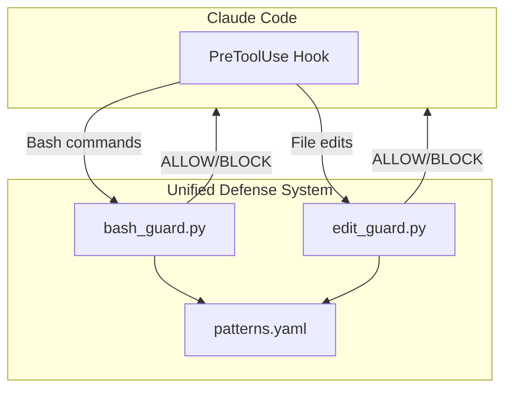

<p align="center">
  
  
  
  
</p>

<h1 align="center">🛡️ Unified Defense</h1>

<p align="center">
  <strong>A self-contained protection system for Claude Code</strong><br>
  Prevent accidental damage to your system with intelligent guardrails
</p>

<p align="center">
  <a href="#-features">Features</a> •
  <a href="#-quick-start">Quick Start</a> •
  <a href="#-terminal-dashboard">Dashboard</a> •
  <a href="#%EF%B8%8F-configuration">Configuration</a> •
  <a href="#-how-it-works">How It Works</a>
</p>

---

## ✨ Features

| Feature | Description |
|---------|-------------|
| 🚫 **Command Blocking** | Stops dangerous commands like `rm -rf /`, `chmod 777`, fork bombs |
| 🔒 **Path Protection** | Guards sensitive files: `.env`, `.ssh/`, `.aws/`, private keys |
| 📋 **Blocklist Mode** | Default mode — blocks only known dangerous patterns |
| 🔐 **Whitelist Mode** | Paranoid mode — blocks everything except explicitly allowed paths |
| 📝 **Audit Logging** | Records all decisions to `~/.claude/defense.log` |
| 🖥️ **Terminal Dashboard** | Interactive UI to manage settings and view logs |
| ⚡ **Zero Dependencies** | Pure Python 3.6+ — no pip packages required |

---

## 🚀 Quick Start

```bash
# Clone the repository
git clone https://github.com/yourusername/unified-defense.git
cd unified-defense

# Install (copies hooks to ~/.claude/hooks/)
chmod +x install.sh
./install.sh

# Restart Claude Code to activate
```

That's it! Unified Defense is now protecting your system.

---

## 🖥️ Terminal Dashboard

Manage your defense settings with an interactive terminal UI:

```bash
python3 defense.py
```

```
╔══════════════════════════════════════════╗
║     🛡️  UNIFIED DEFENSE DASHBOARD  🛡️     ║
╚══════════════════════════════════════════╝

STATUS─────────────────────────────────────
Mode:    📋 BLOCKLIST (Normal)
Logging: ✅ ENABLED

STATISTICS─────────────────────────────────
Total:   42 decisions
Blocked: 7
Allowed: 35

ACTIONS────────────────────────────────────
 ▶ Toggle Mode          RECENT ACTIVITY────────
   Toggle Logging       ✅ ls /tmp
   View Logs            ❌ rm -rf /
   Refresh              ✅ cat file.txt
   Quit                 ❌ chmod 777 script.sh

↑/↓: Navigate  |  Enter: Select  |  q: Quit
```

**Controls:**
- `↑` / `↓` — Navigate menu
- `Enter` — Select action
- `q` — Quit dashboard

---

## ⚙️ Configuration

Edit `~/.claude/hooks/unified-defense/config/patterns.yaml` to customize protection rules.

### Global Settings

```yaml
settings:
  # "blocklist" (default) or "whitelist" (paranoid mode)
  mode: "blocklist"
  
  # Enable audit logging
  logging: true
  log_file: "~/.claude/defense.log"
```

### Operating Modes

| Mode | Behavior | Use Case |
|------|----------|----------|
| `blocklist` | Blocks only patterns in `protected_paths` and `dangerous_commands` | Normal development |
| `whitelist` | Blocks **everything** except paths in `safe_zones` | High-security environments |

### Protected Paths

Define paths Claude cannot access:

```yaml
protected_paths:
  # Completely block access
  - pattern: "~/.ssh/**"
    level: block
    reason: "SSH keys and configuration"

  # Allow read, block write
  - pattern: "/etc/**"
    level: read_only
    reason: "System configuration"
```

### Dangerous Commands

Block dangerous shell commands:

```yaml
dangerous_commands:
  - pattern: "rm -rf /"
    reason: "Recursive force delete from root"
  - pattern: "chmod 777"
    reason: "Overly permissive file permissions"
  - pattern: "curl.*|.*sh"
    reason: "Pipe curl to shell"
```

### Safe Zones

Explicitly allow access to certain paths (takes precedence over blocks):

```yaml
safe_zones:
  - pattern: "/tmp/**"
    reason: "Temporary files"
  - pattern: "~/projects/my-app/**"
    reason: "My current project"
```

### Protection Levels

| Level | Read | Write | Typical Use |
|-------|:----:|:-----:|-------------|
| `block` | ❌ | ❌ | Secrets, credentials, private keys |
| `read_only` | ✅ | ❌ | System files, configuration |
| `allow` | ✅ | ✅ | Project directories, temp files |

---

## 🔧 How It Works

Unified Defense uses [Claude Code hooks](https://docs.anthropic.com/claude-code/hooks) to intercept tool calls before they execute:



### Hook Protocol

| Action | Exit Code | Output |
|--------|:---------:|--------|
| **Allow** | `0` | (none) |
| **Block** | `2` | Reason written to stderr |

When a command is blocked, Claude sees the reason and can adjust its approach.

---

## 📊 Audit Log

When logging is enabled, all decisions are recorded:

```
~/.claude/defense.log
```

Example log entries:
```
[2026-01-07T10:30:45] BASH BLOCK: rm -rf / | Dangerous command: Recursive force delete from root
[2026-01-07T10:30:47] BASH ALLOW: ls /tmp | Command passed security checks
[2026-01-07T10:31:02] EDIT BLOCK: ~/.ssh/config | BLOCKED: SSH keys and configuration
[2026-01-07T10:31:15] EDIT ALLOW: /tmp/test.txt | File edit passed security checks
```

---

## 📁 Project Structure

```
unified-defense/
├── defense.py          # 🖥️ Interactive terminal dashboard
├── install.sh          # 📦 One-click installer
├── uninstall.sh        # 🗑️ Uninstaller
├── README.md           # 📖 Documentation (you are here)
├── config/
│   └── patterns.yaml   # ⚙️ Security rules configuration
└── hooks/
    ├── bash_guard.py   # 🛡️ Bash command protection
    └── edit_guard.py   # 🛡️ File edit protection
```

---

## 🧪 Testing

After installation, test the hooks by asking Claude to perform protected operations:

| Test | Expected Result |
|------|-----------------|
| "Run `rm -rf /`" | ❌ Blocked — Dangerous command |
| "Edit `~/.ssh/config`" | ❌ Blocked — Protected path |
| "Create a file in `/tmp`" | ✅ Allowed — Safe zone |
| "Run `ls -la`" | ✅ Allowed — Safe command |

---

## 🗑️ Uninstall

```bash
./uninstall.sh
```

This removes the hooks from `~/.claude/` and cleans up settings.

---

## 🔒 Default Protected Paths

Out of the box, Unified Defense protects:

| Category | Patterns |
|----------|----------|
| **Secrets** | `**/.env`, `**/.env.*` |
| **SSH** | `~/.ssh/**`, `**/id_rsa*`, `**/id_ed25519*` |
| **Cloud** | `~/.aws/**`, `~/.gnupg/**` |
| **Keys** | `**/*.pem`, `**/*.key` |
| **Tokens** | `~/.npmrc`, `~/.pypirc`, `~/.netrc` |
| **System** | `/etc/**`, `/usr/**`, `/bin/**`, `/sbin/**` (read-only) |

---

## 🤝 Contributing

Contributions welcome! Please feel free to submit issues and pull requests.

---

## 📄 License

MIT License — see [LICENSE](LICENSE) for details.

---

<p align="center">
  <strong>Stay safe. Code with confidence.</strong><br>
  <sub>Built with 🛡️ for the Claude Code community</sub>
</p>
